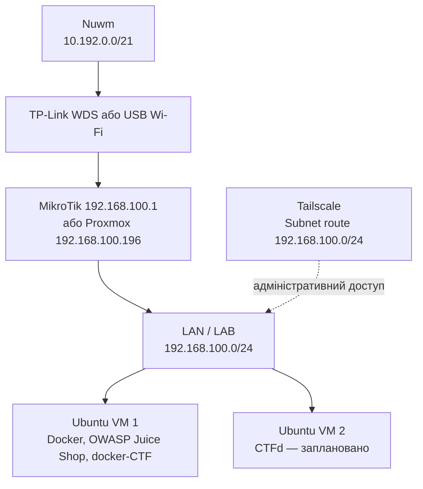

# Логічна топологія

## Мета

Описати логічні мережі, шлюзи та напрямки трафіку кіберполігону.

## Архітектура

Поки керування та лабораторний трафік використовують одну підмережу. Подальше розділення на VLAN слід проєктувати окремо.

## Передумови

- підтверджений активний default gateway для VM;
- актуальні IP-адреси VM;
- погоджена модель сегментації.

## Конфігурація

| Мережа | Призначення | Шлюз |
|---|---|---|
| `10.192.0.0/21` | Зовнішня Wi-Fi мережа | `10.192.7.254` за наданим маршрутом |
| `192.168.0.0/24` | Керування TP-Link | MikroTik має `192.168.0.2` на WAN |
| `192.168.100.0/24` | Proxmox, MikroTik і лабораторні VM | Потребує підтвердження: `.1` або `.196` |
| Tailscale overlay | Віддалене адміністрування | Subnet router на Proxmox |

## Покрокове налаштування

1. Зафіксувати один основний шлюз для `192.168.100.0/24`.
2. Призначити статичні або DHCP-reservation адреси інфраструктурі.
3. Відокремити керування від студентських лабораторних середовищ у плані VLAN.
4. Обмежити міжсегментний доступ правилами firewall.

## Перевірка

Виконати трасування з VM до зовнішньої адреси та підтвердити проходження через очікуваний шлюз.

## Troubleshooting

| Симптом | Можлива причина | Рішення |
|---|---|---|
| Асиметрична маршрутизація | Різні шлюзи для прямого і зворотного трафіку | Уніфікувати default gateway |
| VM бачать керування | Відсутня сегментація | Запровадити VLAN і firewall policy |
| Tailscale не бачить LAN | Маршрут не схвалено або forwarding вимкнено | Перевірити subnet route і IP forwarding |

## Пов'язані документи

- [Огляд мережі](network-overview.md)
- [Адресний план](../network/addressing/subnets.md)
- [Віддалений доступ](../security/remote-access.md)

## Історія змін

| Дата | Автор | Опис зміни |
|---|---|---|
| 2026-07-23 | Команда проєкту | Створено початкову логічну схему |
