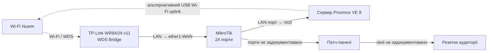

# Фізична топологія

## Мета

Зафіксувати фізичні з’єднання серверної та точки, які ще потрібно промаркувати.

## Архітектура

## Передумови

- доступ до стійки та кабельної інфраструктури;
- маркувальні етикетки;
- можливість перевірити кожну кабельну лінію.

## Конфігурація

| Звідки | Куди | Статус |
|---|---|---|
| TP-Link LAN | MikroTik `ether1-WAN` | Описано |
| MikroTik LAN | Proxmox `nic0` | Описано |
| Proxmox USB | Wi-Fi `Nuwm` | Описано як альтернативний uplink |
| MikroTik | Патч-панелі | Потребує інвентаризації |
| Патч-панелі | Розетки аудиторії | Заплановано документування |

## Покрокове налаштування

1. Присвоїти ідентифікатор кожному порту MikroTik.
2. Промаркувати порти патч-панелей.
3. Визначити відповідність портів аудиторним розеткам.
4. Занести результати до `docs/inventory/port-map.md`.
5. Оновити схему після кожної зміни кабелювання.

## Перевірка

Перевірити кабельним тестером кожну лінію та звірити фактичний link state на MikroTik.

## Troubleshooting

| Симптом | Можлива причина | Рішення |
|---|---|---|
| Порт не піднімається | Кабель або розетка пошкоджені | Перевірити лінію тестером і замінити патч-корд |
| Невідома кінцева розетка | Відсутнє маркування | Виконати трасування і оновити карту портів |
| Нестабільний uplink | Проблема WDS або радіоканалу | Перевірити сигнал і журнал TP-Link |

## Пов'язані документи

- [Огляд мережі](network-overview.md)
- [Логічна топологія](logical-topology.md)
- [Карта портів](../inventory/port-map.md)

## Історія змін

| Дата | Автор | Опис зміни |
|---|---|---|
| 2026-07-23 | Команда проєкту | Створено початкову фізичну схему |
