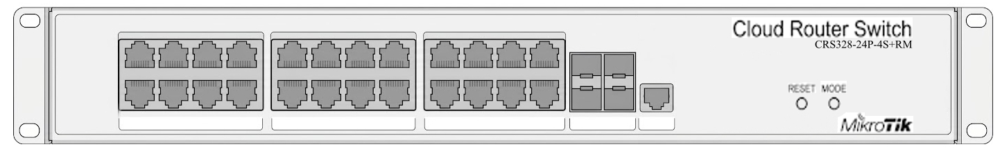

# Мережева архітектура
Фізична та логічна структура мережі навчального кіберполігону, схема адресації, сегментації, комутації та відповідність фізичних розеток портам патч-панелі й мережевого обладнання.

## 1. Загальна архітектура мережі
Центральним мережевим вузлом лабораторії є маршрутизатор-комутатор MikroTik, через який здійснюється комутація та логічна сегментація мережевої інфраструктури.

Мережа лабораторії передбачає два основні режими використання:

- **Навчальний сегмент** — робочі місця, що використовуються під час занять, лабораторних робіт та для доступу до навчальних ресурсів.
- **CTF-сегмент** — ізольоване середовище для проведення Capture The Flag та інших практичних заходів з кібербезпеки.

Сегменти логічно ізолються.

### 1.1. Основні компоненти

| Компонент                           | Призначення                                           |
| ----------------------------------- | ----------------------------------------------------- |
| MikroTik                            | Центральна комутація, маршрутизація та сегментація    |
| Патч-панель                         | Термінація кабелю                                     |
| Proxmox VE                          | Віртуалізація серверної інфраструктури полігону       |
| Точки доступу / мережеве обладнання | Підключення додаткових сегментів та пристроїв         |
| Робочі місця                        | Кінцеві вузли навчального та CTF-сегментів            |

## 2. Фізична топологія
Фізичний рівень мережі побудований за схемою:

`Кінцевий пристрій → мережева розетка → кабельна лінія → патч-панель → патч-корд → MikroTik`

Кожна мережева розетка має унікальний ідентифікатор. Відповідність між розетками, портами патч-панелі та активного мережевого обладнання фіксується у кабельному журналі.

### 2.1. Схема фізичної топології
*Тут розміщується схема фізичних з'єднань мережі.*

### 2.2. Схема передньої панелі MikroTik

> Тимчасове зображення. Призначення портів ще не підтверджено.

## 3. Кабельний журнал
Кабельний журнал визначає актуальну відповідність між стаціонарними мережевими розетками лабораторії, портами патч-панелі та портами активного мережевого обладнання.

### 3.1. Навчальні робочі місця

| ID / порт  | Розташування | Порт MikroTik / Switch  | Призначення             | Статус         | Примітки  |
| ---------- | ------------ | ----------------------- | ----------------------- | -------------- | --------- |
| 1245       | Стіна №1     | ether5                  | Телевізор               | Перевірено     | Зелена зона |
| 1246       | Стіна №2     | ether7                  | Робоче місце викладача  | Перевірено     | Зелена зона |
| 1247       | Стіна №2     | ether8                  | Робоче місце викладача  | Уточнити       | Зелена зона |
| 1248       | Стіна №2     | ether10                 | Навчальне місце         | Перевірено     | Синя зона |
| 1249       | Стіна №2     | ether20                 | Навчальне місце         | Перевірено     | Синя зона |
| 1250       | Стіна №2     | ether22                 | Навчальне місце         | Перевірено     | Синя зона |
| 1251       | Стіна №2     | ether19                 | Навчальне місце         | Уточнити       | Синя зона |
| 1252       | Стіна №2     | ether23                 | Навчальне місце         | Перевірено     | Синя зона |
| 1253       | Стіна №2     | ether24                 | Навчальне місце         | Перевірено     | Синя зона |
| 1254       | Стіна №2     | ether18                 | Навчальне місце         | Перевірено     | Синя зона |
| 1255       | Стіна №2     | ether14                 | Навчальне місце         | Уточнити       | Зелена зона |
| 1256       | Стіна №3     | ether6                  | Телевізор               | Перевірено     | Синя зона |
| 1257       | Стіна №4     | ether17                 | Навчальне місце         | Уточнити       | Синя зона |
| 1258       | Стіна №4     | ether11                 | Навчальне місце         | Перевірено     | Синя зона |
| 1259       | Стіна №4     | ether13                 | Навчальне місце         | Уточнити       | Синя зона |
| 1260       | Стіна №4     | ether12                 | Навчальне місце         | Перевірено     | Синя зона |
| 1261       | Стіна №4     | ether21                 | Навчальне місце         | Перевірено     | Синя зона |
| 1262       | Стіна №4     | ether16                 | Навчальне місце         | Перевірено     | Синя зона |
| 1263       | Стіна №4     | ether15                 | Навчальне місце         | Уточнити       | Синя зона |
  
### 3.2. CTF-робочі місця

| ID / порт  | Розташування | Порт MikroTik / Switch  | Призначення | Статус         | Примітки  |
| ---------- | ------------ | ----------------------- | ----------- | -------------- | --------- |
| 1233       | Стіна №2     |                         | CTF         | Перевірено     | Червона зона |
| 1234       | Стіна №2     |                         | CTF         | Перевірено     | Червона зона |
| 1235       | Стіна №2     |                         | CTF         | Перевірено     | Червона зона |
| 1236       | Стіна №2     |                         | CTF         | Перевірено     | Червона зона |
| 1237       | Стіна №2     |                         | CTF         | Перевірено     | Червона зона |
| 1238       | Стіна №2     |                         | CTF         | Перевірено     | Червона зона |
| 1239       | Стіна №2     |                         | CTF         | Перевірено     | Червона зона |
| 1240       | Стіна №2     |                         | CTF         | Перевірено     | Червона зона |
| 1241       | Стіна №2     |                         | CTF         | Перевірено     | Червона зона |
| 1242       | Стіна №2     |                         | CTF         | Перевірено     | Червона зона |
| 1243       | Стіна №2     |                         | CTF         | Перевірено     | Червона зона |
| 1244       | Стіна №2     |                         | CTF         | Перевірено     | Червона зона |

## 4. Логічна топологія
*Розділ описує логічні мережеві сегменти незалежно від фізичної кабельної інфраструктури.*

### 4.1. Мережеві сегменти

| Сегмент    | VLAN | Підмережа | Шлюз | DHCP | Призначення               |
| ---------- | ---: | --------- | ---- | ---- | ------------------------- |
| Management |  TBD | TBD       | TBD  | TBD  | Керування інфраструктурою |
| Education  |  TBD | TBD       | TBD  | TBD  | Навчальні робочі місця    |
| CTF        |  TBD | TBD       | TBD  | TBD  | Ізольоване середовище CTF |

### 4.2. Маршрутизація
*Опис дозволених маршрутів між сегментами та зовнішніми мережами.*

### 4.3. DHCP та DNS
*Опис DHCP-пулів, статичних призначень та використовуваних DNS-серверів.*

## 5. Підключення серверної інфраструктури

### 5.1. Proxmox VE
*Фізичні інтерфейси, bridge-інтерфейси та їх відповідність мережевим сегментам.*

### 5.2. Віртуальні мережі
*Опис bridge/VLAN та способу підключення віртуальних машин до мережі полігону.*

## 6. Зовнішнє та віддалене підключення
*Опис uplink лабораторії, доступу до Інтернету та маршруту віддаленого доступу.*

Детальні правила та механізми захисту віддаленого доступу описуються окремо в `security/remote-access.md`.

## 7. Правила фізичної комутації
- Кожна стаціонарна мережева розетка повинна мати унікальне маркування.
- Маркування розетки повинно мати однозначну відповідність порту патч-панелі.
- Незадіяні порти патч-панелі за замовчуванням не комутуються з активним мережевим обладнанням.
- Зміна фізичної комутації повинна супроводжуватися актуалізацією кабельного журналу.
- Для різних сегментів допускається використання патч-кордів різного кольору для полегшення візуальної ідентифікації.
- Комутаційна шафа та активне мережеве обладнання повинні бути захищені від несанкціонованого фізичного доступу.

## 8. Схеми
У цьому розділі наводяться актуальні схеми мережі:

- фізична топологія;
- логічна топологія;
- розташування мережевих розеток;
- за необхідності — схема комутаційної шафи.

Вихідні файли схем та їх експортовані версії зберігаються в `docs/assets/`.

---

**Дата останньої перевірки:** TBD
**Відповідальний:** TBD
