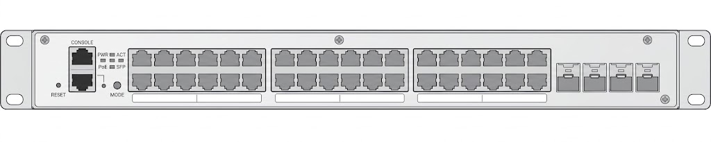

# Мережева архітектура
Фізична та логічна структура мережі навчального кіберполігону, схема адресації, сегментації, комутації та відповідність фізичних розеток портам патч-панелі й мережевого обладнання.

## 1. Загальна архітектура мережі
Центральним мережевим вузлом лабораторії є маршрутизатор-комутатор MikroTik, через який здійснюється комутація та логічна сегментація мережевої інфраструктури.

Мережа лабораторії передбачає два основні режими використання:

- **Навчальний сегмент** — робочі місця, що використовуються під час занять, лабораторних робіт та для доступу до навчальних ресурсів.
- **CTF-сегмент** — ізольоване середовище для проведення Capture The Flag та інших практичних заходів з кібербезпеки.

Сегменти логічно ізолються.

### 1.1. Основні компоненти

| Компонент                           | Призначення                                           |
| ----------------------------------- | ----------------------------------------------------- |
| MikroTik                            | Центральна комутація, маршрутизація та сегментація    |
| Патч-панель                         | Термінація кабелю                                     |
| Proxmox VE                          | Віртуалізація серверної інфраструктури полігону       |
| Точки доступу / мережеве обладнання | Підключення додаткових сегментів та пристроїв         |
| Робочі місця                        | Кінцеві вузли навчального та CTF-сегментів            |

## 2. Фізична топологія
Фізичний рівень мережі побудований за схемою:

`Кінцевий пристрій → мережева розетка → кабельна лінія → патч-панель → патч-корд → MikroTik`

Кожна мережева розетка має унікальний ідентифікатор. Відповідність між розетками, портами патч-панелі та активного мережевого обладнання фіксується у кабельному журналі.

### 2.1. Схема фізичної топології
*Тут розміщується схема фізичних з'єднань мережі.*

### 2.2. Схема передньої панелі MikroTik



> Тимчасове зображення. Призначення портів ще не підтверджено.

## 3. Кабельний журнал
Кабельний журнал визначає актуальну відповідність між стаціонарними мережевими розетками лабораторії, портами патч-панелі та портами активного мережевого обладнання.


### 3.1. Навчальні робочі місця

| ID / порт  | Розташування | Порт MikroTik / Switch  | Призначення             | Статус         | Примітки  |
| ---------- | ------------ | ----------------------- | ----------------------- | -------------- | --------- |
| 1245       | Стіна №1     | ether5                  | Телевізор               | Перевірено     | Зелена зона |
| 1246       | Стіна №2     | ether7                  | Робоче місце викладача  | Перевірено     | Зелена зона |
| 1247       | Стіна №2     | ether8                  | Робоче місце викладача  | Уточнити       | Зелена зона |
| 1248       | Стіна №2     | ether10                 | Навчальне місце         | Перевірено     | Синя зона |
| 1249       | Стіна №2     | ether20                 | Навчальне місце         | Перевірено     | Синя зона |
| 1250       | Стіна №2     | ether22                 | Навчальне місце         | Перевірено     | Синя зона |
| 1251       | Стіна №2     | ether19                 | Навчальне місце         | Уточнити       | Синя зона |
| 1252       | Стіна №2     | ether23                 | Навчальне місце         | Перевірено     | Синя зона |
| 1253       | Стіна №2     | ether24                 | Навчальне місце         | Перевірено     | Синя зона |
| 1254       | Стіна №2     | ether18                 | Навчальне місце         | Перевірено     | Синя зона |
| 1255       | Стіна №2     | ether14                 | Навчальне місце         | Уточнити       | Зелена зона |
| 1256       | Стіна №3     | ether6                  | Телевізор               | Перевірено     | Синя зона |
| 1257       | Стіна №4     | ether17                 | Навчальне місце         | Уточнити       | Синя зона |
| 1258       | Стіна №4     | ether11                 | Навчальне місце         | Перевірено     | Синя зона |
| 1259       | Стіна №4     | ether13                 | Навчальне місце         | Уточнити       | Синя зона |
| 1260       | Стіна №4     | ether12                 | Навчальне місце         | Перевірено     | Синя зона |
| 1261       | Стіна №4     | ether21                 | Навчальне місце         | Перевірено     | Синя зона |
| 1262       | Стіна №4     | ether16                 | Навчальне місце         | Перевірено     | Синя зона |
| 1263       | Стіна №4     | ether15                 | Навчальне місце         | Уточнити       | Синя зона |
  
### 3.2. CTF-робочі місця

| ID / порт  | Розташування | Порт MikroTik / Switch  | Призначення | Статус         | Примітки  |
| ---------- | ------------ | ----------------------- | ----------- | -------------- | --------- |
| 1233       | Стіна №2     |                         | CTF         | Перевірено     | Червона зона |
| 1234       | Стіна №2     |                         | CTF         | Перевірено     | Червона зона |
| 1235       | Стіна №2     |                         | CTF         | Перевірено     | Червона зона |
| 1236       | Стіна №2     |                         | CTF         | Перевірено     | Червона зона |
| 1237       | Стіна №2     |                         | CTF         | Перевірено     | Червона зона |
| 1238       | Стіна №2     |                         | CTF         | Перевірено     | Червона зона |
| 1239       | Стіна №2     |                         | CTF         | Перевірено     | Червона зона |
| 1240       | Стіна №2     |                         | CTF         | Перевірено     | Червона зона |
| 1241       | Стіна №2     |                         | CTF         | Перевірено     | Червона зона |
| 1242       | Стіна №2     |                         | CTF         | Перевірено     | Червона зона |
| 1243       | Стіна №2     |                         | CTF         | Перевірено     | Червона зона |
| 1244       | Стіна №2     |                         | CTF         | Перевірено     | Червона зона |


## 4. Логічна топологія

Наразі всі робочі місця на портах `ether3`–`ether24` підключені до одного
bridge та використовують спільну мережу `192.168.100.0/24`. VLAN і окрема
міжсегментна фільтрація ще не налаштовані.

### 4.1. Мережеві сегменти

#### Поточний стан

| Мережа | Інтерфейс MikroTik | Адреса MikroTik | DHCP | Призначення |
| --- | --- | --- | --- | --- |
| Зовнішня мережа `Nuwm` | `ether1` | Динамічна | DHCP-клієнт | Доступ до зовнішньої мережі через TP-Link WDS |
| Керування TP-Link `192.168.0.0/24` | `ether1` | `192.168.0.2/24` | Немає | Доступ до TP-Link за адресою `192.168.0.1` |
| LAN `192.168.100.0/24` | `bridge_3-24` | `192.168.100.1/24` | `192.168.100.50–192.168.100.100` | Proxmox, навчальні та CTF-робочі місця |

Мережі керування, навчальних робочих місць і CTF зараз не відокремлені.
Пристрої в LAN перебувають в одному широкомовному домені.

#### Запланована сегментація

| Сегмент | VLAN | Підмережа | Призначення | Статус |
| --- | ---: | --- | --- | --- |
| Management | TBD | TBD | Керування MikroTik, Proxmox та іншим обладнанням | Заплановано |
| Education | TBD | TBD | Навчальні робочі місця | Заплановано |
| CTF | TBD | TBD | Ізольоване середовище CTF | Заплановано |

Перед налаштуванням VLAN необхідно визначити порт Proxmox, trunk-порти,
access-порти кожного сегмента, VLAN ID, підмережі, DHCP-пули та дозволені
напрямки трафіку.

### 4.2. Маршрутизація

MikroTik має безпосередньо підключені мережі `192.168.100.0/24` і
`192.168.0.0/24`. Маршрут за замовчуванням повинен отримуватися DHCP-клієнтом
на `ether1`; фактичну адресу, шлюз і стан lease необхідно перевіряти в робочій
системі.

Вихід клієнтів `192.168.100.0/24` через `ether1` виконується правилом
`masquerade`. Окреме правило `src-nat` до `192.168.0.1` потребує перегляду:
воно розміщене після `masquerade` та має `src-address=0.0.0.0`, тому не є
основним правилом доступу клієнтів LAN до TP-Link.

Міжсегментна маршрутизація відсутня, оскільки VLAN ще не створені.

### 4.3. DHCP та DNS

DHCP-сервер `server1` працює на `bridge_3-24` із такими параметрами:

| Параметр | Значення |
| --- | --- |
| Мережа | `192.168.100.0/24` |
| Шлюз клієнтів | `192.168.100.1` |
| Пул адрес | `192.168.100.50–192.168.100.100` |
| Термін оренди | 1 тиждень |
| DNS для DHCP-клієнтів | `8.8.8.8` |

У статичних налаштуваннях самого MikroTik вказані DNS-сервери `8.8.8.8` і
`1.1.1.1`. MikroTik не оголошений DNS-сервером для LAN-клієнтів. Після
створення VLAN для кожного сегмента необхідно визначити окрему DHCP-мережу
та пул адрес.

### 4.4. Firewall

Поточний IPv4 firewall містить лише правило, яке відхиляє нові підключення
WinBox на TCP-порт `8291`, якщо джерело не належить до
`192.168.100.0/24`. Повного захисту `input` немає, а правила `forward`
відсутні. Отже, конфігурація не забезпечує майбутню ізоляцію VLAN і не
реалізує політику заборони за замовчуванням.

Перед увімкненням VLAN необхідно визначити та реалізувати політику:

- керування MikroTik дозволене лише з Management;
- Management має доступ до адміністративних інтерфейсів обладнання;
- Education має доступ до інтернету та визначених навчальних сервісів;
- CTF має доступ лише до дозволених цілей відповідного сценарію;
- прямий обмін між Education і CTF заборонений;
- нові вхідні з'єднання з `ether1` заборонені, якщо для них немає окремого правила;
- `established` і `related` з'єднання дозволені, а `invalid` — відкидаються.

Трафік між пристроями одного VLAN комутується на другому рівні й не
ізолюється правилами IP firewall. Для його розділення пристрої повинні
перебувати в різних VLAN.

## 5. Підключення серверної інфраструктури

### 5.1. Proxmox VE
*Фізичні інтерфейси, bridge-інтерфейси та їх відповідність мережевим сегментам.*

### 5.2. Віртуальні мережі
*Опис bridge/VLAN та способу підключення віртуальних машин до мережі полігону.*

## 6. Зовнішнє та віддалене підключення

Основний задокументований зовнішній канал побудований за такою схемою:

```text
Nuwm Wi-Fi → TP-Link WR841N v11 (WDS) → ether1 MikroTik → LAN
```

LAN-порт TP-Link підключений до `ether1` MikroTik. На цьому інтерфейсі
одночасно налаштована службова адреса `192.168.0.2/24` для доступу до
панелі TP-Link за адресою `http://192.168.0.1` і DHCP-клієнт для отримання
параметрів зовнішньої мережі `Nuwm`.

Клієнти LAN виходять у зовнішню мережу через `masquerade` на `ether1`.
Публікація внутрішніх сервісів через `dst-nat` у поточній конфігурації
відсутня.

Віддалений доступ через Tailscale не відображений у конфігурації MikroTik.
Його фактичний стан, розташування subnet router, анонсовані маршрути та
правила доступу необхідно перевірити на Proxmox і в адміністративній панелі
Tailscale перед внесенням до документації як робочого механізму.

## 7. Правила фізичної комутації
- Кожна стаціонарна мережева розетка повинна мати унікальне маркування.
- Маркування розетки повинно мати однозначну відповідність порту патч-панелі.
- Незадіяні порти патч-панелі за замовчуванням не комутуються з активним мережевим обладнанням.
- Зміна фізичної комутації повинна супроводжуватися актуалізацією кабельного журналу.
- Для різних сегментів допускається використання патч-кордів різного кольору для полегшення візуальної ідентифікації.
- Комутаційна шафа та активне мережеве обладнання повинні бути захищені від несанкціонованого фізичного доступу.

## 8. Схеми
У цьому розділі наводяться актуальні схеми мережі:

- фізична топологія;
- логічна топологія;
- розташування мережевих розеток;
- за необхідності — схема комутаційної шафи.

Вихідні файли схем та їх експортовані версії зберігаються в `docs/assets/`.

---

**Дата останньої перевірки:** TBD
**Відповідальний:** TBD
